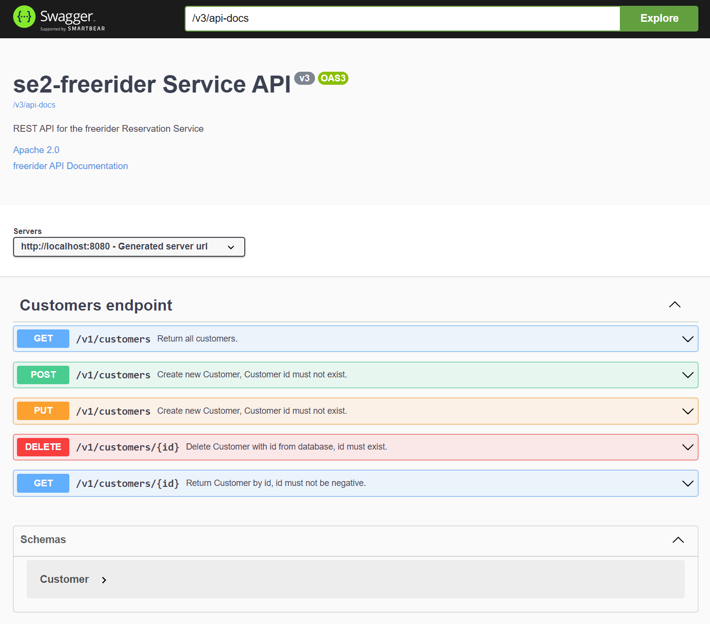
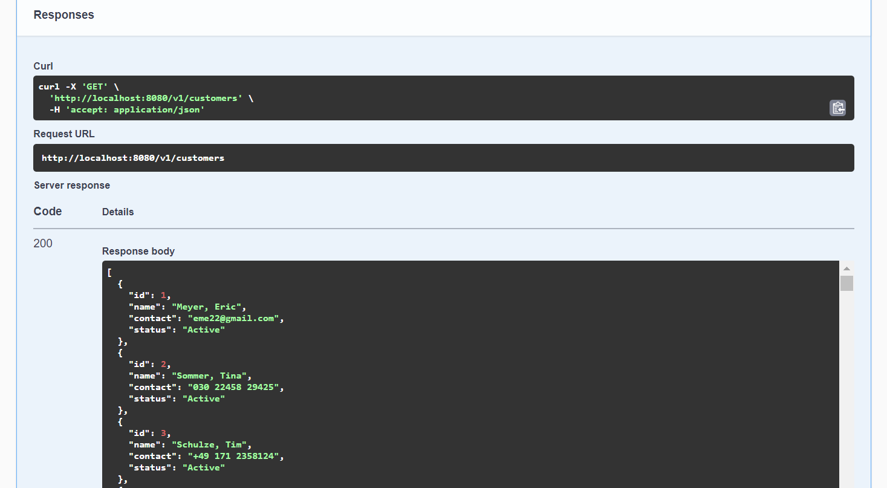

# E3: *se2-freerider* REST Endpoints &nbsp; (<span style="color:red"> 12 Pts + 8 ZP </span>)


Definitions:

- *Endpoint* in network comminications generally refers the ending-point of a communication
    with an *address* at which messages are received and a *protocol* the endpoint understands.

- *Protocol* in networks defines the data formats of messages and the rules of message
    exchange (Ethernet, IEEE 802.x, IP, TCP, HTTP, SSH, WebSockets are examples of protocols).

- *Client / Server* is a technical architecture with

  - multiple clients (applications) exchanging messages with

  - a single server, examples:
    - HTTP-server *httpd*,
    - database-server *mysqld*,
    - ssh-server *sshd*.

- *REST* (Representational State Transfer) is a design pattern for *Endpoints*
    for modern applications and services.

- *REST endpoints*:

  - use the HTTP or HTTPS protocols with operations: GET, PUT, PATCH, POST and DELETE.

  - use JSON Data for exchanges over HTTP-Requests and -Replies.

  - use the URL of the HTTP-Server with added *Routes* (paths) to address

    - a single *Resource* - with singular used in the route-name, e.g. `/status`
        (single resource to inquire the system status) or

    - a *Resource Set* - with plural used in the route-name, e.g. `/reservations`
        (multiple reservations in the system)

        to which messages are delivered.

  - use *Controllers* for each *Resource / ResourceSet* with methods that are
        invoked when the server receives an HTTP-Request that is addressed to the resource/-set.

- *REST API* define a *collection of endpoints* exposed by an application or a service and
    therefore define the interface of that application or a service.

  - REST API should be *versioned* by starting routes with `/v1/...` so that multiple API Versions
    can coexist.

  - REST API should be *documented* using a standard:
    [OpenAPI, v3.1.0](https://spec.openapis.org/oas/v3.1.0).

  - REST API should be *"live"* and developed with tools, e.g. [Swagger](https://swagger.io).

  - Examples of REST API:

    - [PetStore](https://petstore.swagger.io), Swagger API,

    - [Spotify](https://developer.spotify.com/documentation/web-api/reference/#/), REST API,

    - [OpenWeather](https://openweathermap.org/api), REST API.

See article *John Au-Yeung, Ryan Donovan: [Best practices for REST API design](https://stackoverflow.blog/2020/03/02/best-practices-for-rest-api-design)*, Feb. 2020.


&nbsp;

The reservation system of the *se2-freerider* application has three endpoints:

- `/customers` - with: GET, POST (new customer), PUT (update customer information),

- `/vehicles` - with: GET (only retrieve vehicle information).

- `/reservations` - with: GET, POST (new reservation inquiry), PUT (update reservation, e.g. status),
    DELETE.


&nbsp;

Each endpoint defines operations with:

- a HTTP operation,

- a Route,

- a Data schema for (JSON)-Objects sent with the HTTP-Request,

- a Data schema of (JSON)-Objects received with the HTTP-Reply,

- a set of [HTTP Response Codes](https://developer.mozilla.org/en-US/docs/Web/HTTP/Status)
    (200: ok, 404: not found, etc.).

The following defines `CRUD`-operations for the `/customers` endpoint.

The full definition of the `/customers` endpoint without schema for data objects is:


&nbsp;

<style>
    table td, table td * {
        vertical-align: top;
    }
    .bolded { font-weight: bold; }
    .route { font-weight: bold; }
    .ok { color: lightgreen; }
    .err { color: red; }
</style>
<table>
<th>CRUD<th>HTTP-Operation<th>Route<th>HTTP-Request<th>HTTP-Reply<tr>

<td>Create<td>
    <span class="bolded">POST</span><td>
    <span class="route">/customers</span><td>
    Create new Customer.<br>
    - Data: JSON with Customer data im Request‐Body, new id is assigned by the system.<td>
    Response Codes:
    <span class="ok">201</span>: created,
    <span class="err">400</span>: bad request {json body},
    <span class="err">409</span>: conflict, e.g. object not accepted.<tr>

<td>Read<td>
    <span class="bolded">GET</span><td>
    <span class="route">/customers<br></span><td>
    Return all Customer data as JSON.<td>
    JSON with all Customer data in Response‐Body.<br>
    Response Codes:
    <span class="ok">200</span>: ok<tr>

<td>Read<td>
    <span class="bolded">GET</span><td>
    <span class="route">/customers/{id}</span><td>
    Return JSON for Customer with id.<br>
    - Parameter: id.<td>
    JSON for Customer data in Response‐Body.<br>
    Response Codes:
    <span class="ok">200</span>: ok,
    <span class="err">400</span>: bad request {id},
    <span class="err">404</span>: not found.<tr>

<td>Update<td>
    <span class="bolded">PUT</span><td>
    <span class="route">/customers</span><td>
    Update Customer. Customer with id must exist.<br>
    - Data: Customer data as JSON im Request‐Body, includes id.<td>
    Response Codes:
    <span class="ok">202</span>: accepted,
    <span class="err">400</span>: bad request {json body},
    <span class="err">404</span>: not found.<tr>

<td>Delete<td>
    <span class="bolded">DELETE</span><td>
    <span class="route">/customers/{id}</span><td>
    Delete Customer with id.<td>
    <span class="ok">202</span>: accepted,
    <span class="err">400</span>: bad request {id},
    <span class="err">404</span>: not found,
    <span class="err">409</span>: conflict (foreign key dependency).<tr>

</table>


---

&nbsp;

### Challenges
1. [Challenge 1:](#1-run-customersrestcontroller-that-supports-the-customers-entdpoint) Run CustomersRestController that supports the /customers entdpoint  - (1 Pt)
2. [Challenge 2:](#2-explore-swagger-ui) Explore Swagger UI - (1 Pt)
3. [Challenge 3:](#3-define-endpoints) Define Endpoints - (4 Pts)
4. [Challenge 4:](#4-build-endpoint-vehicles) Build Endpoint /vehicles - (2 Pts)
5. [Challenge 5:](#5-build-endpoint-reservations-mocked) Build Endpoint /reservations (mocked) - (4 Pt)
6. [Challenge 6:](#6-build-dataaccessreservations-to-support-reservations) Build DataAccessReservations to support /reservations - (+4 ZP)
7. [Challenge 7:](#7-build-endpoint-reservations-real) Build Endpoint /reservations (real) - (+4 ZP)


&nbsp;

---
## 1. Run CustomersRestController that supports the /customers entdpoint

Pull code-drop from branch
[jdbc_ep](https://github.com/sgra64/se2-freerider/tree/jdbc_ep)
and integrate into the `se2-freerider` project:

```
Updated:
src/main/java/de/freerider/application/FreeriderApplication.java
src/main/java/de/freerider/data_jdbc/DataAccess.java
src/main/java/de/freerider/data_jdbc/DataAccessImpl.java
src/main/java/de/freerider/data_jdbc/JDBC_QueryRunner.java
src/main/java/de/freerider/data_jdbc/DataAccessException.java
src/main/resources/application.yaml

New:
src/main/java/de/freerider/endpoints/CustomersEP.java
src/main/java/de/freerider/endpoints/CustomersEPDoc.java
src/main/java/de/freerider/endpoints/CustomersRestController.java

src/main/resources/swagger.properties
src/main/java/de/freerider/application/SwaggerConfig.java
```

Add dependencies to `pom.xml` to include the HTTP-server (tomcat) and
Swagger/OpenAPI.

```
https://mvnrepository.com/artifact/org.springframework.boot/spring-boot-starter-web
no version (inherited from Spring Boot)

https://mvnrepository.com/artifact/org.springdoc/springdoc-openapi-starter-webmvc-ui
version: 2.0.2
```

1.) Build the project.

```
mvn compile
mvn package -DskipTests=true

ls -la target
total 27288
-rwxrwxr-x+ 1 svgr2 Kein 27876095 Jan 17 20:13 se2-freerider-0.0.1-SNAPSHOT.jar*
-rwxrwxr-x+ 1 svgr2 Kein    48468 Jan 17 20:13 se2-freerider-0.0.1-SNAPSHOT.jar.original*
```

2.) Start the database (wait until the database server *mysqld* is up in the container).

3.) Run the Spring application:
```
java -jar target/se2-freerider-0.0.1-SNAPSHOT.jar

20:15:38.533 [main] INFO de.freerider.application.FreeriderApplication -
(0.) Spring Container starting.

  .   ____          _            __ _ _
 /\\ / ___'_ __ _ _(_)_ __  __ _ \ \ \ \
( ( )\___ | '_ | '_| | '_ \/ _` | \ \ \ \
 \\/  ___)| |_)| | | | | || (_| |  ) ) ) )
  '  |____| .__|_| |_|_| |_\__, | / / / /
 =========|_|==============|___/=/_/_/_/
 :: Spring Boot ::                (v3.0.1)

Starting FreeriderApplication v0.0.1-SNAPSHOT using Java 19 with PID 14500 (C:\S
ven1\svgr\workspaces\2-SE\se2-freerider\target\se2-freerider-0.0.1-SNAPSHOT.jar
started by svgr2 in C:\Sven1\svgr\workspaces\2-SE\se2-freerider)
No active profile set, falling back to 1 default profile: "default"
...
Tomcat initialized with port(s): 8080 (http)    <-- HTTP-Server started
Starting service [Tomcat]
...
(2.) Spring Container ready.
Hello FreeriderApplication!

Tomcat waiting for HTTP-requests...
```

4.) Wait for application startup until the HTTP-Server (Tomcat) ready and waiting for HTTP-Requests.

5.) Open
[http://localhost:8080/swagger-ui/index.html#/](http://localhost:8080/swagger-ui/index.html#/)
in a browser.

6.) Swagger-UI should appear showing the API for the `/customers` endpoint.


&nbsp;

---
## 2. Explore Swagger UI

Swagger API for the `/customers` endpoint:

&nbsp;



1. Open route `GET /customers`

    - select "Try-it-out"

    - "Execute"

Swagger-UI (browser) sends a GET-Request to the HTTP-Server, which forwards the
request to code registered for `GET /customers` in package `endpoints`:

- `CustomersEP.java` - interface with `@RequestMapping` annotations.

- `CustomersEPDoc.java` - interface with OpenAPI doc annotations that appear in
    Swagger-UI and in OpenAPI-docs.

- `CustomersRestController.java` - non-public implementation of interface with
    actual code.


Method annotated with `@GetMapping("/v1/customers")` in `CustomersEP.java`:

```java
@RequestMapping("/v1/customers")
public interface CustomersEP extends CustomersEPDoc {

    @GetMapping("")
    @Override
    Iterable<Customer> findAllCustomers();
  ...
}
```

Code for interface methods is in `CustomersRestController.java`, which is registered
as `@RestController` in Spring. Code uses the JDBC-DAO (Data-Access-Object) from the
`data_jdbc`-package that offers access methods to query the database:

```java
@RestController
class CustomersRestController implements CustomersEP {

    /**
     * DataAccess (object) DAO is a component to accesses data in the
     * database through SQL queries.
     */
    @Autowired
    private DataAccess dao;

    @Override
    public Iterable<Customer> findAllCustomers() {
        //
        return dao.findAllCustomers();  // query database and return all Customer objects
    }
    ...
}
```

Returning all Customers as `Iterable<Customer>` causes Customer Java-objects be serialized
to JSON, which is returned in the `ResponseBody` of the HTTP-Response returned from Tomcat
to Swagger-UI.

Swagger-UI displays JSON-serialized Customer data in the `ResponseBody` with response
code `200` (OK).





Explore other routes:

- `GET /customers/{id}` - with providing a specific `id` for the query.

- `POST /customers` - requires JSON data for a new Customer (id not in the database).

- `PUT /customers` - requires JSON data to update an exsting Customer (id found in the database).

- `DELETE /customers/{id}` - to delete the Customer with id.

JSON-data is needed for the `POST` and `PUT` request bodies.

Try `POST` with the JSON with a new `id` (1111) that does not yet exist in the database:

```
{
  "id": 1111,
  "name": "Hofmann, Ulrike",
  "contact": "030 384 4934",
  "status": "Active"
}
```

Swagger-UI should return code: `201` (created).

Find new Customer in the database:

```
SELECT * FROM CUSTOMER WHERE ID > 1000;

+------+-----------------+--------------+--------+
| ID   | NAME            | CONTACT      | STATUS |
+------+-----------------+--------------+--------+
| 1111 | Hofmann, Ulrike | 030 384 4934 | Active |
+------+-----------------+--------------+--------+
1 row in set (0.00 sec)
```

Retry the request on Swagger-UI.

Swagger-UI returns error code: `409` (conflict) since an object with `id: 1111`
already exists.

Update the telephone number with: `030 777 7777`

```
{
  "id": 1111,
  "name": "Hofmann, Ulrike",
  "contact": "030 777 7777",
  "status": "Active"
}
```

Swagger-UI returns code:  `202` (accepted).

Re-run the SQL-Query to verify the updated phone number:

```
SELECT * FROM CUSTOMER WHERE ID > 1000;

+------+-----------------+--------------+--------+
| ID   | NAME            | CONTACT      | STATUS |
+------+-----------------+--------------+--------+
| 1111 | Hofmann, Ulrike | 030 777 7777 | Active |
+------+-----------------+--------------+--------+
1 row in set (0.00 sec)
```

Finally, delete Customer with `id` (1111).

```
SELECT * FROM CUSTOMER WHERE ID > 1000;

Empty set (0.00 sec)
```

Repeat the delete. Swagger-UI will show code:  `404` (not found).


&nbsp;

The tool [curl](https://curl.se) is a popular command line tool to issue HTTP requests.
If you have installed, try:

Specify the HTTP-Operation with option `-X` (`GET` is default):

```
curl http://localhost:8080/v1/customers/1
curl -X GET http://localhost:8080/v1/customers/1
```

Output:

```
{"id":1,"name":"Meyer, Eric","contact":"eme22@gmail.com","status":"Active"}
```

Get the respose code with option `-I`:

```
curl -I http://localhost:8080/v1/customers/1
HTTP/1.1 200

curl -I http://localhost:8080/v1/customers/1111
HTTP/1.1 404
```

See the full HTTP Request / Response:

```
curl -v http://localhost:8080/v1/customers/1
```

Load file: [cust_1111.json](./cust_1111.json) with `POST` to create new
object in the database:

```
curl -X POST http://localhost:8080/v1/customers -d @cust_1111.json -H "Content-Type: application/json"

curl -X GET http://localhost:8080/v1/customers/1111
{"id":1111,"name":"Hofmann, Ulrike","contact":"030 384 4934","status":"Active"}
```

Delete customer with `id: 1111`:

```
curl -X DELETE -I http://localhost:8080/v1/customers/1111
HTTP/1.1 202
Content-Length: 0
```

Verify:

```
curl -I http://localhost:8080/v1/customers/1111
HTTP/1.1 404
```


&nbsp;

---
## 3. Define Endpoints

Use the definition of the `/customers` endpoint as reference to define the
remaining REST endpoints for:

- `/vehicles` - this endpoint only supports the

    - the retrieval of all and

    - of specific (by `id`) vehicle data as JSON.

- `/reservations` - the endpoint supports the:

    - retrieval of all and for specific (by `id`) reservation data as JSON,

    - sending reservation inquiries from a client device and recording them
        in the database,
    
    - updating a reservations (e.g. status, times, locations) and

    - deleting a reservation.

- Include in the definition:

    - the HTTP operation,

    - the route with parameters (if any),

    - the data supplied in the Request-Body (brief description),

    - the data returned in the Response-Body and

    - the Response-Codes indicating success or error conditions.


Use [E3_Anlage_REST.docx](./E3_Anlage_REST.docx?raw=true)
to fill in the definitions for both REST endpoints.

<!-- [Anlage_REST.docx](https://github.com/sgra64/se2-freerider/blob/jdbc_ep/E3_Anlage_REST.docx?raw=true) -->


&nbsp;

---
## 4. Build Endpoint /vehicles

Build the `/vehicles` endpoint according to the REST API definition
supporting:

- the retrieval of all and

- of specific (by `id`) vehicle data as JSON.

Refer to the implementation for Customer in package `endpoints` use
data-access methods from `DataAccessVehicles` in package `data_jdbc`.

Verify the implementation on Swagger-UI, including returns codes, e.g.
for vehicles with `id` not found in the database.


&nbsp;

---
## 5. Build Endpoint /reservations (mocked)

Build the `/reservations` endpoint according to the REST API definition
supporting the: 

- retrieval of all and for specific (by `id`) reservation data as JSON,

- sending reservation inquiries from a client device and recording them
    in the database,

- updating a reservations (e.g. status, times, locations) and

- deleting a reservation.

The MOCK-version does not access the database yet, it only responds
to HTTP-Requests and returns mocked data.

Swagger-UI also works with mocked data.


&nbsp;

---
## 6. Build DataAccessReservations to support /reservations

Implement `DataAccessReservations`-DAO in package `data_jdbc` to support
the operations of the `/reservations` RestController in package `endpoints`.

Steps:

- define methods in the DAO-interface `DataAccessReservations.java`.

- implement the interface in `DataAccessReservationsImpl.java`.


&nbsp;

---
## 7. Build Endpoint /reservations (real)

Connect with the `/reservations` RestController in package `endpoints`
with the `DataAccessReservations` DAO in package `data_jdbc` to
replace the MOCK-version with one that executes requests in the database.

Demonstrate the endpoint with Swagger-UI.
