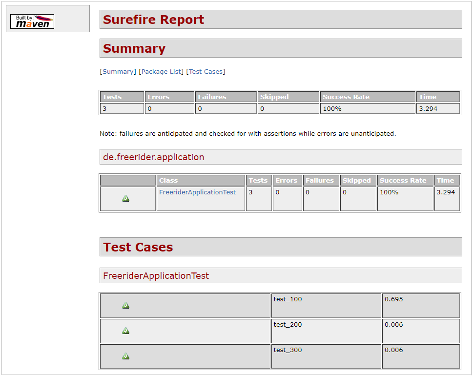

# E1: Spring Boot *se2-freerider* Project Setup &nbsp; (<span style="color:red"> 9 Pts </span>)

Goal of the *se2-freerider* application is to provide access to the data managed in the *db-freerider*
[database](https://github.com/sgra64/db-freerider)
and provide REST endpoints for a car sharing reservation system.

Spring Boot is a modular framework suitable to build Java applications that expose REST endpoints
and require access to databases.

Creating a Spring Boot application requires using a build-tool (*maven* or *gradle*) and
follows certain steps. A Spring Boot project also has a certain structure.

### Challenges
1. [Challenge 1:](#1-initialize-new-spring-boot-project) Initialize new Spring Boot Project - (2 Pts)
2. [Challenge 2:](#2-build-and-run-the-application) Build and Run the Application - (2 Pts)
3. [Challenge 3:](#3-build-and-run-tests) Build and Run Tests - (2 Pts)
4. [Challenge 4:](#4-build-and-run-test-reports) Build and Run Test Reports - (1 Pts)
5. [Challenge 5:](#5-check-project-into-remote-repository) Check Project into your own Remote Repository - (2 Pts)


&nbsp;

---
## 1. Initialize new Spring Boot Project

Configure the Spring Boot project at [Spring Initializr](https://start.spring.io/)
following the dialog and download the project.

For Visual Studio Code, extension *Spring Boot Tools* can be installed from the
market place (although not required). If installed, search for *initialzr* in the
Command Palette (Ctrl + Shift + P) and follow the dialog.

In both dialogs, select:
- Maven project
- Java
- Version: 3.0.1
- GAV:
    - **G**roup: `de.freerider` -- turns into Java package path 
    - **A**rtifact: `se2-freerider` -- turns into name of project directory
    - **V**ersion: `0.0.1-SNAPSHOT`
    - name: se2-freerider
    - description: *Software-Engineering-II Freerider car sharing project*
    - package name: 0.0.1-SNAPSHOT
    - packaging: `jar`
    - java: `19` (depending on your installed Java version, chose 17 or 11)

Setup the project in a local project directory: `se2-freerider`.

The project structure must match the scaffold (adjust if needed and insert
project source and test files from this GitHub repository, remove source files
generated by `initializr`).

```sh
--<se2-freerider>:
 |
 +--<.env.sh>                   # script to source the project
 +--<.run.sh>                   # use by IDE runner to run code fast
 |
 +--<.git>                      # local git repository
 +--.gitignore
 +-- ...
 +-- pom.xml                    # maven's central project file
 |
 +--<src/main/java>:            # project sources (resource and .java files)
 |        |    |
 |        |    +--<de/freerider>:           # artefact package path
 |        |            +--> <application>   # local package path
 |        |                   |
 |        |                   +--> AppConfig.java
 |        |                   +--> FreeriderApplication.java
 |        +--<resources>:
 |             +--> application.yaml    # application configuration file
 |             |
 |             +--<META-INF>            # Spring metadata (generated by IDE)
 |             +--<static>              # packaged static web content
 |             +--<templates>           # packaged html processor (Thymeleaf) templates
 |
 +--<src/test/java>:            # test sources (.java files)
 |        |    |
 |        |    +--<de/freerider>:           # artefact package path
 |        |            +--> <application>   # local package path
 |        |                   |
 |        |                   +--> FreeriderApplicationTest.java
 |        |
 |        +--<resources>:       # configurations for test runs
 |             +--> logback-test.xml   # disable log messages during tests
 |
 +--<target>                    # directory with all results (not initially present)
 |    +--> se2-freerider-0.0.1-SNAPSHOT.jar  # main executable artefact
 |    +--<classes>              # compiled sources (.class files)
 |    +--<generated-sources>
 |    +--<generated-test-sources>
 |    +--<maven-archiver>
 |    +--<maven-status>
 |    +--<site>                 # test reports as site, index.html
 |    +--<surefire-report>      # test reports
 |    +--<test-classes>         # compiled test classes
 |
```
Java application packages begin at: `src/java/main`, followed by the group package path:
`de.freerider`.

`application.yaml` (or `application.properties`) contains configuration
information for the Spring Boot application.

`pom.xml` is the central file for the Maven build-process.
Verify configurations in `pom.xml` (adjust if needed):

```xml
<!-- Use Spring Boot as parent project. -->
<parent>
    <groupId>org.springframework.boot</groupId>
    <artifactId>spring-boot-starter-parent</artifactId>
    <version>3.0.1</version>
    <relativePath/> <!-- lookup parent from repository -->
</parent>

<!-- Project GAV with groupId (G), artifactId (A) and version (V). -->
<groupId>de.freerider</groupId>
<artifactId>se2-freerider</artifactId>
<version>0.0.1-SNAPSHOT</version>

<!-- The properties section defines variables used in pom.xml. -->
<properties>
    <java.version>19</java.version>
    <skipTests>false</skipTests>    <!-- skip running tests -->
</properties>
```

Spring Boot is a modular framework. Only components of the framework
are loaded into the application that are defined as dependencies in
`pom.xml`. In the minimal configuration, only two components are loaded:
`spring-boot-starter` and `spring-boot-starter-test`.

```xml
<!-- 
    The dependencies section defines project dependenencies with Spring packages
    chosen from:
        https://mvnrepository.com/artifact/org.springframework.boot
-->
<dependencies>
    <!-- https://mvnrepository.com/artifact/org.springframework.boot/spring-boot-starter -->
    <dependency>
        <groupId>org.springframework.boot</groupId>
        <artifactId>spring-boot-starter</artifactId>
    </dependency>

    <!-- https://mvnrepository.com/artifact/org.springframework.boot/spring-boot-starter-test -->
    <dependency>
        <groupId>org.springframework.boot</groupId>
        <artifactId>spring-boot-starter-test</artifactId>
        <scope>test</scope>
    </dependency>
</dependencies>
```

Dependencies are sufficient to build and run the simple Spring application
`FreeriderApplication.java` that only prints a message:

```
Hello FreeriderApplication!
```

Maven is used to build the application with following commands:

```perl
# maven commands to build project:
mvn validate                        # validate correctness of pom.xml
mvn compile                         # compile sources to: target/classes
mvn test-compile                    # compile tests to: target/test-classes
mvn test                            # run tests, create: target/surefire-reports
mvn package                         # create: target/se2-freerider-0.0.1-SNAPSHOT.jar

mvn site -DgenerateReports=false    # create css and images for: target/site
mvn surefire-report:report          # run tests, create: target/site/index.html
mvn site -DgenerateReports=false surefire-report:report     # do both

mvn spring-boot:run                 # run application

mvn clean                           # remove target directory

mvn dependency:tree                 # show dependency tree
mvn dependency:build-classpath      # show classpath
```

Perform following commands and explore their results:

```perl
mvn validate            # validate correctness of pom.xml
```

Output:

```
[INFO] Scanning for projects...
[INFO]
[INFO] ---------------------< de.freerider:se2-freerider >---------------------
[INFO] Building se2-freerider 0.0.1-SNAPSHOT
[INFO] --------------------------------[ jar ]---------------------------------
[INFO] ------------------------------------------------------------------------
[INFO] BUILD SUCCESS
[INFO] ------------------------------------------------------------------------
[INFO] Total time:  0.504 s
[INFO] Finished at: 2022-12-28T22:52:01+01:00
[INFO] ------------------------------------------------------------------------
```

Show dependency tree (all imported packages with their included imports):

```perl
mvn dependency:tree     # show dependency tree
```

Output:

```
[INFO] Scanning for projects...
[INFO]
[INFO] ---------------------< de.freerider:se2-freerider >---------------------
[INFO] Building se2-freerider 0.0.1-SNAPSHOT
[INFO] --------------------------------[ jar ]---------------------------------
[INFO]
[INFO] --- maven-dependency-plugin:3.3.0:tree (default-cli) @ se2-freerider ---
[INFO] de.freerider:se2-freerider:jar:0.0.1-SNAPSHOT
[INFO] +- org.springframework.boot:spring-boot-starter:jar:3.0.1:compile
[INFO] |  +- org.springframework.boot:spring-boot:jar:3.0.1:compile
[INFO] |  |  \- org.springframework:spring-context:jar:6.0.3:compile
[INFO] |  |     +- org.springframework:spring-aop:jar:6.0.3:compile
[INFO] |  |     +- org.springframework:spring-beans:jar:6.0.3:compile
[INFO] |  |     \- org.springframework:spring-expression:jar:6.0.3:compile
[INFO] |  +- org.springframework.boot:spring-boot-autoconfigure:jar:3.0.1:compil
e
[INFO] |  +- org.springframework.boot:spring-boot-starter-logging:jar:3.0.1:comp
ile
[INFO] |  |  +- ch.qos.logback:logback-classic:jar:1.4.5:compile
[INFO] |  |  |  \- ch.qos.logback:logback-core:jar:1.4.5:compile
[INFO] |  |  +- org.apache.logging.log4j:log4j-to-slf4j:jar:2.19.0:compile
[INFO] |  |  |  \- org.apache.logging.log4j:log4j-api:jar:2.19.0:compile
[INFO] |  |  \- org.slf4j:jul-to-slf4j:jar:2.0.6:compile
[INFO] |  +- jakarta.annotation:jakarta.annotation-api:jar:2.1.1:compile
[INFO] |  +- org.springframework:spring-core:jar:6.0.3:compile
[INFO] |  |  \- org.springframework:spring-jcl:jar:6.0.3:compile
[INFO] |  \- org.yaml:snakeyaml:jar:1.33:compile
[INFO] \- org.springframework.boot:spring-boot-starter-test:jar:3.0.1:test
[INFO]    +- org.springframework.boot:spring-boot-test:jar:3.0.1:test
[INFO]    +- org.springframework.boot:spring-boot-test-autoconfigure:jar:3.0.1:t
est
[INFO]    +- com.jayway.jsonpath:json-path:jar:2.7.0:test
[INFO]    |  +- net.minidev:json-smart:jar:2.4.8:test
[INFO]    |  |  \- net.minidev:accessors-smart:jar:2.4.8:test
[INFO]    |  |     \- org.ow2.asm:asm:jar:9.1:test
[INFO]    |  \- org.slf4j:slf4j-api:jar:2.0.6:compile
[INFO]    +- jakarta.xml.bind:jakarta.xml.bind-api:jar:4.0.0:test
[INFO]    |  \- jakarta.activation:jakarta.activation-api:jar:2.1.0:test
[INFO]    +- org.assertj:assertj-core:jar:3.23.1:test
[INFO]    |  \- net.bytebuddy:byte-buddy:jar:1.12.20:test
[INFO]    +- org.hamcrest:hamcrest:jar:2.2:test
[INFO]    +- org.junit.jupiter:junit-jupiter:jar:5.9.1:test
[INFO]    |  +- org.junit.jupiter:junit-jupiter-api:jar:5.9.1:test
[INFO]    |  |  +- org.opentest4j:opentest4j:jar:1.2.0:test
[INFO]    |  |  +- org.junit.platform:junit-platform-commons:jar:1.9.1:test
[INFO]    |  |  \- org.apiguardian:apiguardian-api:jar:1.1.2:test
[INFO]    |  +- org.junit.jupiter:junit-jupiter-params:jar:5.9.1:test
[INFO]    |  \- org.junit.jupiter:junit-jupiter-engine:jar:5.9.1:test
[INFO]    |     \- org.junit.platform:junit-platform-engine:jar:1.9.1:test
[INFO]    +- org.mockito:mockito-core:jar:4.8.1:test
[INFO]    |  +- net.bytebuddy:byte-buddy-agent:jar:1.12.20:test
[INFO]    |  \- org.objenesis:objenesis:jar:3.2:test
[INFO]    +- org.mockito:mockito-junit-jupiter:jar:4.8.1:test
[INFO]    +- org.skyscreamer:jsonassert:jar:1.5.1:test
[INFO]    |  \- com.vaadin.external.google:android-json:jar:0.0.20131108.vaadin1
:test
[INFO]    +- org.springframework:spring-test:jar:6.0.3:test
[INFO]    \- org.xmlunit:xmlunit-core:jar:2.9.0:test
[INFO] ------------------------------------------------------------------------
[INFO] BUILD SUCCESS
[INFO] ------------------------------------------------------------------------
[INFO] Total time:  2.793 s
[INFO] Finished at: 2022-12-28T22:50:22+01:00
[INFO] ------------------------------------------------------------------------
```

Count .jar files needed and aquired by maven to build the project. The output
of `mvn dependency:tree` is filtered for .jar files with the `grep` command.
Its output, lines that contain .jar, are then counted with the `wc` (word count)
command:

```
mvn dependency:tree | grep .jar | wc
```

`wc`'s output (lines, words, bytes) shows 48 lines:

```
     48     193    3192
```

It means that 48 .jar files are needed to build a basic Spring Boot application
that only prints: `Hello FreeriderApplication!` without any further module
added.

Compile source .java files to .class files:

```perl
mvn compile             # compile sources to: target/classes
find target/classes
```

Output:

```
target/classes
target/classes/application.yaml
target/classes/de
target/classes/de/freerider
target/classes/de/freerider/application
target/classes/de/freerider/application/AppConfig.class
target/classes/de/freerider/application/FreeriderApplication.class
```

Package .jar as final artefact:

```py
mvn package             # create: target/se2-freerider-0.0.1-SNAPSHOT.jar
ls -la target
```

Output:

```
total 9196
drwxrwxr-x+ 1 svgr2 Kein       0 Dec 28 22:03 .
drwxrwxr-x+ 1 svgr2 Kein       0 Dec 28 22:19 ..
drwxrwxr-x+ 1 svgr2 Kein       0 Dec 26 23:10 classes
drwxrwxr-x+ 1 svgr2 Kein       0 Dec 26 21:31 generated-sources
drwxrwxr-x+ 1 svgr2 Kein       0 Dec 26 21:31 generated-test-sources
drwxrwxr-x+ 1 svgr2 Kein       0 Dec 26 21:34 maven-archiver
drwxrwxr-x+ 1 svgr2 Kein       0 Dec 26 21:31 maven-status
-rwxrwxr-x+ 1 svgr2 Kein 9387059 Dec 28 21:41 se2-freerider-0.0.1-SNAPSHOT.jar
-rwxrwxr-x+ 1 svgr2 Kein    4612 Dec 28 21:41 se2-freerider-0.0.1-SNAPSHOT.jar.original
...
```


&nbsp;

---
## 2. Build and Run the Application

Spring Boot has multiple ways to run an application after it is built.

The run-script `.run.sh` is the fastest way to run the application since it only relies on
compiled sources without running a build tool. The CLASSPATH environment variable must be
set once during sourcing the project with `.env.sh`.

`.run.sh` can be configured for the Java code runner to quickly run Spring code in the IDE
during development avoiding longer build and packaging times (see `.vscode/settings.json`).

Build artefacts and run the application in all three variations:

```perl
mvn spring-boot:run     # Spring's full build and run

# run the packaged artefact
java -jar target/se2-freerider-0.0.1-SNAPSHOT.jar

# run compiled sources (fastest for IDE Runners) 
.run.sh
```

Output for all three variations:

```
23:13:10.277 [main] INFO de.freerider.application.FreeriderApplication - (0.) Sp
ring Container starting.

  .   ____          _            __ _ _
 /\\ / ___'_ __ _ _(_)_ __  __ _ \ \ \ \
( ( )\___ | '_ | '_| | '_ \/ _` | \ \ \ \
 \\/  ___)| |_)| | | | | || (_| |  ) ) ) )
  '  |____| .__|_| |_|_| |_\__, | / / / /
 =========|_|==============|___/=/_/_/_/
 :: Spring Boot ::                (v3.0.0)

Starting FreeriderApplication using Java 19 with PID 9896 (C:\Sven1\svgr\workspa
ces\2-SE\se2-freerider\target\classes started by svgr2 in C:\Sven1\svgr\workspac
es\2-SE\se2-freerider)

No active profile set, falling back to 1 default profile: "default"

(1.) FreeriderApplication instance created.

Started FreeriderApplication in 1.323 seconds (process running for 1.867)

(2.) Spring Container ready.
Hello FreeriderApplication!

(3.) Spring Container exited.
```

Trace the log-lines marked with `(0.)` ... `(3.)` in the Spring Boot's main application file
`FreeriderApplication.java`. All actions > (0.) are triggered by the Spring IoC container
according to the *Inversion-of-Control* principle,
[link](https://martinfowler.com/articles/injection.html).


&nbsp;

---
## 3. Build and Run Tests

Next, build and run Tests. All three test-methods in `FreeriderApplicationTest.java`
should succeed:

```
mvn test
```

Output:

```
...
[INFO] -------------------------------------------------------
[INFO]  T E S T S
[INFO] -------------------------------------------------------
[INFO] Running de.freerider.application.FreeriderApplicationTest
23:30:50,141 |-WARN in Logger[org.springframework.core.env.PropertySourcesProper
tyResolver] - No appenders present in context [default] for logger [org.springfr
amework.core.env.PropertySourcesPropertyResolver].
...
  .   ____          _            __ _ _
 /\\ / ___'_ __ _ _(_)_ __  __ _ \ \ \ \
( ( )\___ | '_ | '_| | '_ \/ _` | \ \ \ \
 \\/  ___)| |_)| | | | | || (_| |  ) ) ) )
  '  |____| .__|_| |_|_| |_\__, | / / / /
 =========|_|==============|___/=/_/_/_/
 :: Spring Boot ::                (v3.0.1)

(1.) FreeriderApplication instance created.
(2.) Spring Container ready.
Hello FreeriderApplication!
performing test: test_100()
performing test: test_200()
performing test: test_300()
[INFO] Tests run: 3, Failures: 0, Errors: 0, Skipped: 0, Time elapsed: 2.651 s -
 in de.freerider.application.FreeriderApplicationTest
[INFO]
[INFO] Results:
[INFO] Tests run: 3, Failures: 0, Errors: 0, Skipped: 0
[INFO]
[INFO] ------------------------------------------------------------------------
[INFO] BUILD SUCCESS
[INFO] ------------------------------------------------------------------------
...
```


&nbsp;

---
## 4. Build and Run Test Reports

Tests-Reports are created to summarize results of complex test runs that are usually
performed on dedicated test servers overnight. Test-Reports are rendered in form of a
generated web-site that can be viewed with a browser.


```perl
mvn site -DgenerateReports=false    # create css and images for: target/site
mvn surefire-report:report          # run tests, create: target/site/surefire-report.html
```

Or perform both combined:

```
mvn site -DgenerateReports=false surefire-report:report     # do both
```

The test report is found in: `target/site/surefire-report.html`.
Open file in browser:

<!--  -->


&nbsp;

---
## 5. Check Project into Remote Repository

Put the project under *git* control and check into your remote GitHub or BHT GitLab repository (in *main* or *master* branch).

Show all local and remote branches:

```
git branch -a
```

Output shows some commits to the main branch in the remote repository:

```
* main
  remotes/origin/HEAD -> origin/main
  remotes/origin/main
```

Show commits to main branch in remote repository:

```
git log remotes/origin/main --name-status
git log remotes/origin/main --oneline
```

Output shows some commits to the main branch in the remote repository
(your commits should show similar files, but not necessarily in the same order):

```
commit f79136ac5e2ae8369d8e5fd837f3cd5a7a17ae53 (HEAD -> main, origin/main, orig
in/HEAD)
Author: Sven Graupner <sgraupner@bht-berlin.de>
Date:   Wed Dec 28 22:25:43 2022 +0000

    add initial se2-freerider project, main branch

A       .env.sh
A       .run.sh
A       .vscode/settings.json
A       .vscode/vscode_memo.sh
A       pom.xml
A       src/main/java/de/freerider/application/AppConfig.java
A       src/main/java/de/freerider/application/FreeriderApplication.java
A       src/main/resources/application.yaml
A       src/test/java/de/freerider/application/FreeriderApplicationTest.java
A       src/test/resources/logback-test.xml

commit 6611ac3215d164fb84e03f0cedb2a4a9e8422841
Author: sgra64 <sgraupner@beuth-hochschule.de>
Date:   Mon Nov 21 12:40:21 2022 +0100

    Initial commit

A       .gitignore
A       README.md
```

